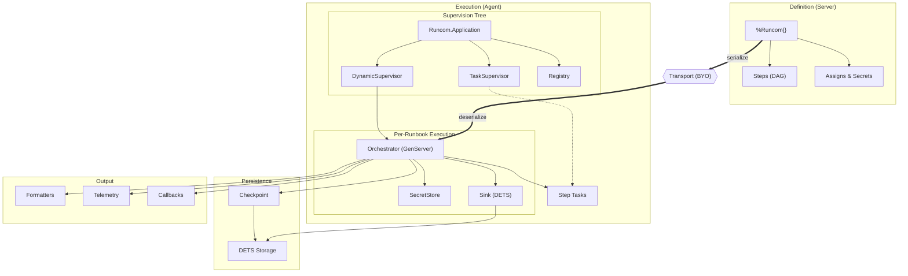

# Runcom

Runcom is an Elixir library for defining multi-step operations that:

- Execute on remote agents (definition and execution are separate)
- Checkpoint progress for resume after restart/crash
- Support async steps with explicit await dependencies
- Composable (runbooks can include other runbooks)
- Store state in DETS for resilience and inspection
- Use pluggable adapters for testing and custom execution
- Emit telemetry events for observability
- Capture stdout/stderr as lines for audit trails

**What Runcom is:**
- A behaviour-based DSL for defining change plans
- A supervised executor with DETS state and checkpointing
- Serializable for distributed execution
- Testable via pluggable adapters (inspired by Req)

**What Runcom is not:**
- A transport layer (bring your own: RabbitMQ, HTTP, etc.)
- A scheduler or inventory system
- Windows compatible (POSIX only for now)

## Architecture



**Key concepts:**

- **Runbook (`%Runcom{}`)** - A DAG of steps with assigns and secrets. Serializable for remote execution.
- **Orchestrator** - GenServer managing execution lifecycle, checkpointing, and callbacks.
- **Steps** - Behaviour-based modules (`Runcom.Step`) executed as supervised tasks.
- **Sink** - Captures stdout/stderr for audit trails (default: DETS-backed).
- **Checkpoint** - Enables resume after crash/restart by persisting state after each step.

## Installation

```elixir
def deps do
  [
    {:runcom, "~> 0.1.0"}
  ]
end
```

## Configure

```elixir
config Runcom,
  formatters: [Runcom.Formatter.Markdown, Runcom.Formatter.Asciinema],
  checkpoint_dir: "/var/lib/my-app"
```

## Quick Start

```elixir
runbook =
  Runcom.new("deploy-1.4.0")
  |> Runcom.secret(:ring, "keep it secret, keep it safe")
  |> Runcom.assign(:version, "1.4.0")
  |> Runcom.assign(:artifact_url, "https://releases.example.com")
  |> RC.GetUrl.step("download", 
       url: &("#{&1.artifact_url}/app-#{&1.version}.tar.gz"),
       dest: "/tmp/app.tar.gz",
       retry: [max: 3, delay: 1_000, backoff: :exponential],
       assert: &(&1.bytes > 0)
     )
  |> RC.Unarchive.step("extract", 
       src: "/tmp/app.tar.gz",
       dest: &("/opt/releases/#{&1.version}")
     )
  |> RC.Systemd.step("restart", 
       name: "service",
       state: :restarted,
       assert: &(&1.state == :running)
     )
  |> RC.Wait.step("health", port: 4000, timeout: 60_000)

# Serialize for transmission to agent
{:ok, binary} = Runcom.serialize(runbook)

# On agent: deserialize and execute
{:ok, runbook} = Runcom.deserialize(binary)
{:ok, pid} = Runcom.run(runbook,
  checkpoint_dir: "/var/lib/runcom",
  formatters: [Runcom.Formatter.Markdown, Runcom.Formatter.Asciinema],
  on_complete: &send_result_to_cloud/1,
  on_failure: &send_result_to_cloud/1
)
```

## Built-in Bash interpreter

Bash not required!

Your server may have a collection of Bash scripts that need to be executed or
available on your hosts. Runcom (server) can provide a centralized store of
those scripts, and then Runcom (guest) can fetch and cache those scripts and
access the server. For example:

Runcom (Server)

```elixir
defmodule MyApp.Scripts do
  use Bash.Interop, namespace: "myapp"

  defbash script_1(args, session) do
    Bash.puts("hi")
  end

  defbash script_2(args, session) do
    secrets = File.read!("secret-store") |> String.split("\n") |> Enum.map(& String.split(&1, "=", parts: true, trim: true))
    for {key, value} <- secrets do
      Bash.puts("Key: #{key}")
      Bash.puts("Value: #{value}")
      Bash.puts("===============")
    end
  end
end
```

Runcom (Guest)

```elixir
Runcom.new()
|> Runcom.Bash.step("script-1", definition: "myapp.script-1")
|> Runcom.Bash.step("script-2", definition: "myapp.script-2")
```

`script-2` is a native Elixir `defbash` function streams IO to the server, which
then can stream IO back to the guest, as if it were a native function.

The guest will, at runtime, interact with the server at execution time to 
execute that definition.

This is helpful if you have a central server that is the source of truth, and
hundreds of hosts that need to be brought to a certain state. You no longer have
to synchronize a toolkit to the guests, as long as it has the Runcom agent
running on it and a connection to the Runcom server.

## Built-in Steps

| Step | Purpose |
|------|---------|
| `Runcom.Steps.Bash` | Execute bash scripts via interpreter or file |
| `Runcom.Steps.Command` | Execute shell command |
| `Runcom.Steps.GetUrl` | Download file |
| `Runcom.Steps.Unarchive` | Extract archive |
| `Runcom.Steps.File` | Manage files/directories |
| `Runcom.Steps.Copy` | Copy or write files |
| `Runcom.Steps.Systemd` | Manage systemd services |
| `Runcom.Steps.WaitFor` | Wait for port/file/condition |
| `Runcom.Steps.Debug` | Log message |
| `Runcom.Steps.Pause` | Pause execution |
| `Runcom.Steps.EExTemplate` | EEx template evaluation |
| `Runcom.Steps.Reboot` | Reboot the machine |
| `Runcom.Steps.Apt` | Manage APT packages |
| `Runcom.Steps.Brew` | Manage Homebrew packages |
