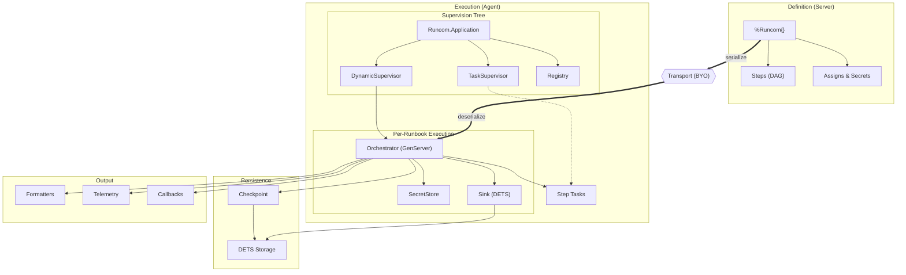

# Runcom

A composable DSL for defining and executing multi-step change plans with
checkpointing, designed for reliable distributed infrastructure automation.

Runbooks are defined as DAGs of steps on a server, serialized, and executed on
remote agents. Each step runs as a supervised task with stdout/stderr capture,
retry logic, and checkpoint persistence for crash recovery or reboot resilience.

**What Runcom is:**
- A behaviour-based DSL for defining change plans as step DAGs
- A supervised executor with DETS state and checkpointing
- Serializable for distributed execution across agents
- Testable via pluggable stubs (inspired by Req)

**What Runcom is not:**
- A transport layer (bring your own: RabbitMQ, HTTP, etc.)
- A scheduler or inventory system
- Windows compatible (POSIX only)

## Architecture



## Installation

```elixir
def deps do
  [{:runcom, "~> 0.1.0"}]
end
```

## Configuration

```elixir
config :runcom,
  formatters: [Runcom.Formatter.Markdown, Runcom.Formatter.Asciinema],
  artifact_dir: "/var/lib/runcom",
  default_sink: {Runcom.Sink.DETS, []}

# In test.exs — disable output capture:
config :runcom, default_sink: {Runcom.Sink.Null, []}
```

The `:default_sink` option accepts a `{module, opts}` tuple. When omitted, defaults
to `{Runcom.Sink.DETS, []}`. For DETS, the file path is auto-derived from the
runbook id. You can override per-runbook via `Runcom.new("id", sink: my_sink)`.

See `Runcom.Sink` for available implementations.

## Hello World

```elixir
require Runcom.Steps.Command, as: Command

# `require` is needed because `add/3` is a macro
runbook =
  Runcom.new("hello")
  |> Command.add("greet", cmd: "echo 'Hello from Runcom!'")

{:ok, rc} = Runcom.run_sync(runbook)
Runcom.result(rc, "greet").output
# => "Hello from Runcom!\n"
```

## Quick Start

### Define a runbook

```elixir
defmodule MyApp.Runbooks.Deploy do
  use Runcom.Runbook, name: "deploy"

  # `require` is needed because `add/3` is a macro
  require Runcom.Steps.Command, as: Command
  require Runcom.Steps.GetUrl, as: GetUrl
  require Runcom.Steps.Systemd, as: Systemd

  schema do
    field :version, :string, required: true
    field :artifact_url, :string, default: "https://releases.example.com"
  end

  @impl true
  def build(assigns) do
    Runcom.new("deploy-#{assigns.version}", name: "Deploy v#{assigns.version}")
    |> Runcom.assign(:version, assigns.version)
    |> GetUrl.add("download",
         url: &("#{&1.assigns.artifact_url}/#{&1.assigns.version}.tar.gz"),
         dest: "/tmp/app.tar.gz"
       )
    |> Systemd.add("restart", name: "app", enabled: true, state: :restarted)
  end
end
```

### DAG dependencies

```elixir
Runcom.new("parallel-example")
# First step is an entry point
|> Command.add("check_disk", cmd: "df -h /")
# await: [] makes it a parallel entry point
|> Command.add("check_memory", cmd: "free -m", await: [])
# Fan-in: waits for both
|> Command.add("deploy", cmd: "deploy.sh", await: ["check_disk", "check_memory"])
```

### Deferred values

Options can be functions that resolve at execution time, accessing assigns and
prior step results:

```elixir
|> Command.add("log",
     cmd: &("echo 'Downloaded to #{Runcom.result(&1, "download").output}'")
   )
```

### Secrets

Secrets are resolved lazily, passed as upcased env vars to bash steps, and redacted
from formatter output:

```elixir
Runcom.new("api-call")
|> Runcom.secret(:api_key, fn -> System.get_env("API_KEY") end)
|> Bash.add(script: ~b"curl -H 'Authorization: Bearer $API_KEY' ...", secrets: [:api_key])
```

## Execution

```elixir
# Synchronous
{:ok, rc} = Runcom.run_sync(runbook)
{:ok, rc} = Runcom.run_sync(runbook, mode: :dryrun)

# Asynchronous
{:ok, pid} = Runcom.run_async(runbook,
  on_complete: fn rc -> send_result(rc) end,
  on_failure: fn rc -> alert(rc) end
)
{:ok, rc} = Runcom.await(pid)

# Resume from checkpoint
{:ok, pid} = Runcom.resume("deploy-1.4.0")
```

## Result Inspection

```elixir
Runcom.result(rc, "download")            # %Runcom.Step.Result{}
Runcom.result(rc, "download").output      # step return value
Runcom.ok?(rc, "download")               # true | false
Runcom.read_stdout(rc, "download")       # captured stdout
Runcom.read_stderr(rc, "download")       # captured stderr
```

`result.output` is the **structured value** the step chose to return via
`Result.ok(output: ...)` — use it for logic, passing data between steps, and
assertions. `read_stdout`/`read_stderr` are the **raw bytes** the underlying
process printed — use them for debugging, logging, and display.

## Error Handling

Runbook execution returns `{:ok, rc}` even when individual steps fail — the
runbook completed its run, it just has failures in it. Check `rc.status` or
per-step results to determine what happened:

```elixir
{:ok, rc} = Runcom.run_sync(runbook)

case rc.status do
  :completed -> IO.puts("all steps succeeded")
  :failed    -> IO.puts("one or more steps failed")
  :halted    -> IO.puts("a step halted execution (e.g. assertion failed)")
end

# Inspect a specific failure
unless Runcom.ok?(rc, "deploy") do
  result = Runcom.result(rc, "deploy")
  IO.puts("deploy failed: #{result.error}")
  IO.puts("stderr: #{Runcom.read_stderr(rc, "deploy")}")
  IO.puts("attempts: #{result.attempts}")
end

# Steps that depend on a failed step are skipped
rc.step_status
# => %{"download" => :ok, "extract" => :error, "restart" => :skipped}
```

The function returns `{:error, reason}` only for infrastructure failures (e.g.,
the orchestrator process crashed). Step-level errors are always inside the `rc`.

## Testing

Stub mode replaces real execution with test doubles, inspired by `Req.Test`. Stubs
propagate to child processes via ProcessTree — no extra setup for async tests.

Add `config :runcom, mode: :stub` to `config/test.exs`, then register stubs per test:

```elixir
test "deploy succeeds", %{test: test_name} do
  id = to_string(test_name)

  # Stubs match on {step_name, opts} — use step names to route
  Runcom.Test.stub(id, fn
    {"download", %{cmd: "curl" <> _}} ->
      {:ok, Result.ok(output: "/tmp/app.tar.gz")}

    {"restart", _opts} ->
      {:ok, Result.ok(exit_code: 0)}
  end)

  runbook =
    Runcom.new(id)
    |> Command.add("download", cmd: "curl -o /tmp/app.tar.gz ...")
    |> Systemd.add("restart", name: "app", state: :restarted, await: ["download"])

  assert {:ok, rc} = Runcom.run_sync(runbook, mode: :stub)
  assert Runcom.ok?(rc, "restart")
end
```

## Built-in Steps

| Step | Purpose |
|------|---------|
| `Runcom.Steps.Bash` | Execute bash scripts via built-in interpreter |
| `Runcom.Steps.Command` | Execute shell command |
| `Runcom.Steps.GetUrl` | Download file |
| `Runcom.Steps.Http` | HTTP request with status assertion |
| `Runcom.Steps.Unarchive` | Extract archive |
| `Runcom.Steps.File` | Manage files/directories |
| `Runcom.Steps.Copy` | Copy or write files |
| `Runcom.Steps.Lineinfile` | Manage individual lines in text files |
| `Runcom.Steps.Blockinfile` | Manage marked text blocks in files |
| `Runcom.Steps.EExTemplate` | EEx template evaluation |
| `Runcom.Steps.Systemd` | Manage systemd services |
| `Runcom.Steps.WaitFor` | Wait for port/file/condition |
| `Runcom.Steps.User` | Manage user accounts |
| `Runcom.Steps.Group` | Manage system groups |
| `Runcom.Steps.Hostname` | Manage system hostname |
| `Runcom.Steps.Debug` | Log message |
| `Runcom.Steps.Pause` | Pause execution |
| `Runcom.Steps.Reboot` | Reboot the machine |
| `Runcom.Steps.Apt` | Manage APT packages |
| `Runcom.Steps.AptRepository` | Manage APT repository sources |
| `Runcom.Steps.Brew` | Manage Homebrew packages |

## Custom Steps

```elixir
defmodule MyApp.Steps.HealthCheck do
  use Runcom.Step, name: "Health Check"

  schema do
    field :url, :string, required: true
    field :timeout, :integer, default: 5_000
  end

  @impl true
  def run(_rc, opts) do
    case Req.get(opts.url, receive_timeout: opts.timeout) do
      {:ok, %{status: 200}} -> {:ok, Result.ok(output: "healthy")}
      {:ok, resp} -> {:ok, Result.error(error: "status #{resp.status}")}
      {:error, reason} -> {:error, reason}
    end
  end
end
```

### Evaluated Steps

Define `run_eval/2` instead of `run/2` when the step body references modules
that only exist on the agent. The body is captured as AST at compile time and
evaluated via `Code.eval_quoted/2` on the agent with `rc` and `opts` bound:

```elixir
defmodule MyApp.Steps.AgentCheck do
  use Runcom.Step, name: "Agent Check"

  def run_eval(rc, _opts) do
    version = MyAgentApp.Version.current()
    {:ok, Result.ok(output: "agent #{rc.assigns.name} at #{version}")}
  end
end
```

## Code Sync

When custom steps are used in runbooks dispatched to remote agents, their
bytecode must be shipped alongside the runbook. `Runcom.CodeSync` handles this
automatically via a compilation tracer.

Apps that define custom steps must enable the tracer in `mix.exs`:

```elixir
def project do
  [
    ...
    elixirc_options: [tracers: [Runcom.CodeSync.Tracer]]
  ]
end
```

The tracer records compile-time dependencies for each `use Runcom.Step` module.
`Runcom.CodeSync.bundle/1` walks these manifests to build precise bytecode
bundles.

## Glossary

| Term | Meaning |
|------|---------|
| **Runbook** | A module that builds a `%Runcom{}` struct — the complete execution plan |
| **Step** | A single operation in a runbook (e.g., run a command, download a file) |
| **DAG** | Directed acyclic graph — steps declare dependencies via `await:`, forming a graph that determines execution order and parallelism |
| **Entry point** | A step with no dependencies — it runs immediately when execution starts |
| **Assigns** | User-defined key-value pairs on the runbook, accessible to all steps via `rc.assigns` |
| **Facts** | Read-only system info (OS, arch, hostname, memory) gathered at execution time, available via `rc.facts` |
| **Sink** | A pluggable output backend that captures step stdout/stderr (see `Runcom.Sink`) |
| **Checkpoint** | A snapshot of runbook state written to disk after each step, enabling resume after crash or reboot |
| **Dispatch** | Sending a runbook to one or more remote agent nodes for execution |
| **Node** | A remote agent machine that receives and executes dispatched runbooks |
| **Graft** | Embedding one runbook's steps into another, merging their DAGs |
| **Deferred value** | A function in step opts that resolves at execution time (e.g., `&Runcom.result(&1, "prior_step").output`) |
| **Executor** | Stateless module that sets up ETS tables and starts the Orchestrator and step tasks |
| **Orchestrator** | GenServer that drives execution — schedules steps, manages retries, writes checkpoints |

## Behaviours

| Behaviour | Purpose | Default |
|-----------|---------|---------|
| `Runcom.Store` | Persist results, secrets, and dispatches | configure via `config :runcom, :store` |
| `Runcom.Checkpoint` | Crash recovery state | `Runcom.Checkpoint.DETS` |
| `Runcom.Sink` | Output capture protocol | `Runcom.Sink.DETS` |
| `Runcom.Formatter` | Render execution output | `Markdown`, `Asciinema` |

## Telemetry

See `Runcom.Telemetry` for the full event catalog with measurements and metadata.
