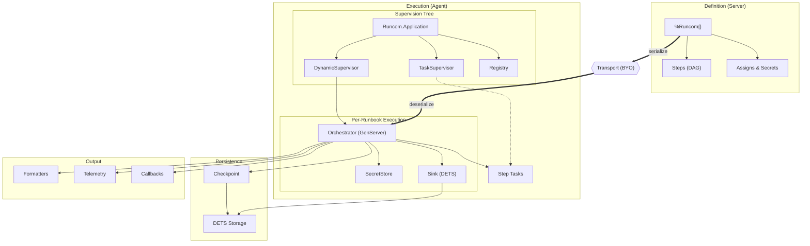

# Runcom

A composable DSL for defining and executing multi-step change plans with
checkpointing, designed for reliable distributed infrastructure automation.

Runbooks are defined as DAGs of steps on a server, serialized, and executed on
remote agents. Each step runs as a supervised task with stdout/stderr capture,
retry logic, and checkpoint persistence for crash recovery or reboot resilience.

**What Runcom is:**
- A behaviour-based DSL for defining change plans as step DAGs
- A supervised executor with DETS state and checkpointing
- Serializable for distributed execution across agents
- Testable via pluggable stubs (inspired by Req)

**What Runcom is not:**
- A transport layer (bring your own: RabbitMQ, HTTP, etc.)
- A scheduler or inventory system
- Windows compatible (POSIX only)

## Architecture



## Installation

```elixir
def deps do
  [{:runcom, "~> 0.1.0"}]
end
```

## Configuration

```elixir
config :runcom,
  formatters: [Runcom.Formatter.Markdown, Runcom.Formatter.Asciinema],
  checkpoint_dir: "/var/lib/runcom"
```

## Quick Start

### Define a runbook

```elixir
defmodule MyApp.Runbooks.Deploy do
  use Runcom.Runbook, name: "deploy"

  require Runcom.Steps.Command, as: Command
  require Runcom.Steps.GetUrl, as: GetUrl
  require Runcom.Steps.Systemd, as: Systemd

  schema do
    field :version, :string, required: true
    field :artifact_url, :string, default: "https://releases.example.com"
  end

  @impl true
  def build(assigns) do
    Runcom.new("deploy-#{assigns.version}", name: "Deploy v#{assigns.version}")
    |> Runcom.assign(:version, params.version)
    |> GetUrl.add("download",
         url: &("#{&1.assigns.artifact_url}/#{&1.assigns.version}.tar.gz"),
         dest: "/tmp/app.tar.gz"
       )
    |> Systemd.add("restart", name: "app", enabled: true, state: :restarted)
  end
end
```

### DAG dependencies

```elixir
Runcom.new("parallel-example")
# First step is an entry point
|> Command.add("check_disk", cmd: "df -h /")
# await: [] makes it a parallel entry point
|> Command.add("check_memory", cmd: "free -m", await: [])
# Fan-in: waits for both
|> Command.add("deploy", cmd: "deploy.sh", await: ["check_disk", "check_memory"])
```

### Deferred values

Options can be functions that resolve at execution time, accessing assigns and
prior step results:

```elixir
|> Command.add("log",
     cmd: &("echo 'Downloaded to #{Runcom.output(&1, "download")}'")
   )
```

### Secrets

Secrets are resolved lazily, passed as upcased env vars to bash steps, and redacted
from formatter output:

```elixir
Runcom.new("api-call")
|> Runcom.secret(:api_key, fn -> System.get_env("API_KEY") end)
|> Bash.add(script: ~b"curl -H 'Authorization: Bearer $API_KEY' ...", secrets: [:api_key])
```

## Execution

```elixir
# Synchronous
{:ok, rc} = Runcom.run_sync(runbook)
{:ok, rc} = Runcom.run_sync(runbook, mode: :dryrun)

# Asynchronous
{:ok, pid} = Runcom.run_async(runbook,
  on_complete: fn rc -> send_result(rc) end,
  on_failure: fn rc -> alert(rc) end
)
{:ok, rc} = Runcom.await(pid)

# Resume from checkpoint
{:ok, pid} = Runcom.resume("deploy-1.4.0")
```

## Result inspection

```elixir
Runcom.result(rc, "download")            # %Runcom.Step.Result{}
Runcom.output(rc, "download")            # step output value
Runcom.ok?(rc, "download")               # true | false
Runcom.read_stdout(rc, "download")       # captured stdout
Runcom.read_stderr(rc, "download")       # captured stderr
```

## Testing

```elixir
test "deploy succeeds" do
  Runcom.Test.stub("test-deploy", fn
    {"download", _opts} -> {:ok, Result.ok(output: "/tmp/app.tar.gz")}
    {"restart", _opts} -> {:ok, Result.ok(exit_code: 0)}
  end)

  runbook =
    Runcom.new("test-deploy")
    |> Command.add("download", cmd: "curl ...")
    |> Command.add("restart", cmd: "systemctl restart app")

  assert {:ok, rc} = Runcom.run_sync(runbook, mode: :stub)
  assert Runcom.ok?(rc, "restart")
end
```

## Built-in Steps

| Step | Purpose |
|------|---------|
| `Runcom.Steps.Bash` | Execute bash scripts via built-in interpreter |
| `Runcom.Steps.Command` | Execute shell command |
| `Runcom.Steps.GetUrl` | Download file |
| `Runcom.Steps.Unarchive` | Extract archive |
| `Runcom.Steps.File` | Manage files/directories |
| `Runcom.Steps.Copy` | Copy or write files |
| `Runcom.Steps.Systemd` | Manage systemd services |
| `Runcom.Steps.WaitFor` | Wait for port/file/condition |
| `Runcom.Steps.Debug` | Log message |
| `Runcom.Steps.Pause` | Pause execution |
| `Runcom.Steps.EExTemplate` | EEx template evaluation |
| `Runcom.Steps.Reboot` | Reboot the machine |
| `Runcom.Steps.Apt` | Manage APT packages |
| `Runcom.Steps.Brew` | Manage Homebrew packages |

## Custom Steps

```elixir
defmodule MyApp.Steps.HealthCheck do
  use Runcom.Step

  schema do
    field :url, :string, required: true
    field :timeout, :integer, default: 5_000
  end

  @impl true
  def name, do: "Health Check"

  @impl true
  def run(_rc, opts) do
    case Req.get(opts.url, receive_timeout: opts.timeout) do
      {:ok, %{status: 200}} -> {:ok, Result.ok(output: "healthy")}
      {:ok, resp} -> {:ok, Result.error(error: "status #{resp.status}")}
      {:error, reason} -> {:error, reason}
    end
  end
end
```

## Behaviours

| Behaviour | Purpose | Default |
|-----------|---------|---------|
| `Runcom.Store` | Persist results, secrets, and dispatches | configure via `config :runcom, :store` |
| `Runcom.Checkpoint` | Crash recovery state | `Runcom.Checkpoint.DETS` |
| `Runcom.Sink` | Output capture protocol | `Runcom.Sink.DETS` |
| `Runcom.Formatter` | Render execution output | `Markdown`, `Asciinema` |

## Telemetry

```elixir
[:runcom, :step, :start]     # %{system_time: ...}
[:runcom, :step, :stop]      # %{duration: native_time}
[:runcom, :step, :exception] # %{duration: native_time}
[:runcom, :run, :start]      # runbook started
[:runcom, :run, :stop]       # runbook completed
```
