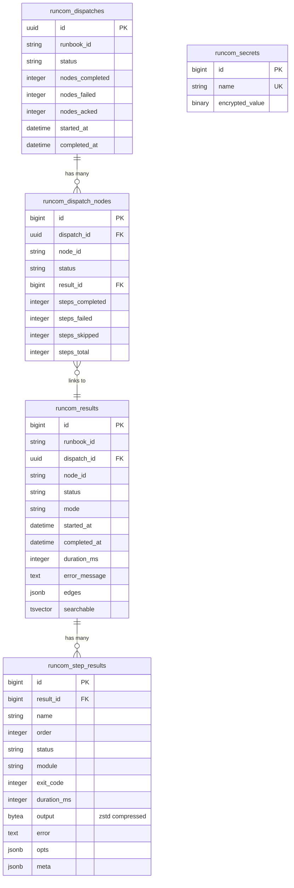

# RuncomEcto

Ecto-backed persistence for Runcom. Implements `Runcom.Store`
behaviour using Postgres with versioned migrations.

## Schema



## Installation

```elixir
def deps do
  [{:runcom_ecto, "~> 0.1.0"}]
end
```

## Setup

1. Configure the store:

```elixir
config :runcom,
  store: {RuncomEcto.Store, repo: MyApp.Repo},
  vault_key: "a-32-byte-secret-key-here!!!!!!"
```

2. Create a migration in your consuming app:

```elixir
defmodule MyApp.Repo.Migrations.AddRuncom do
  use Ecto.Migration

  def up, do: RuncomEcto.Migrations.up()
  def down, do: RuncomEcto.Migrations.down()
end
```

3. Run `mix ecto.migrate`

## Tables

| Table | Purpose |
|-------|---------|
| `runcom_results` | Execution results with tsvector search |
| `runcom_step_results` | Per-step results with compressed output |
| `runcom_dispatches` | Dispatch batch records |
| `runcom_dispatch_nodes` | Per-node dispatch tracking |
| `runcom_secrets` | AES-256 encrypted secrets |

## Store API

`RuncomEcto.Store` implements `Runcom.Store`:

```elixir
# Results
RuncomEcto.Store.save_result(attrs)
RuncomEcto.Store.get_result(id)
RuncomEcto.Store.list_results()
RuncomEcto.Store.search_results("deploy failure")

# Secrets
RuncomEcto.Store.put_secret("api_key", "sk-secret-value")
RuncomEcto.Store.fetch_secret("api_key")    # {:ok, "sk-secret-value"}
RuncomEcto.Store.list_secrets()              # {:ok, [%{name: "api_key", inserted_at: ...}]}
RuncomEcto.Store.delete_secret("api_key")

# Analytics
RuncomEcto.Store.run_rate()              # runs per time bucket
RuncomEcto.Store.timing_stats()          # avg/p50/p95/max per runbook
RuncomEcto.Store.status_rates()          # completion/failure rates
RuncomEcto.Store.step_timing_stats()     # per-step timing breakdown
RuncomEcto.Store.count_results()         # total and failure counts

# Dispatch tracking
RuncomEcto.Store.create_dispatch(attrs)
RuncomEcto.Store.create_dispatch_node(attrs)
RuncomEcto.Store.update_dispatch_node(dispatch_node, attrs)
```

All functions accept an optional `repo: MyApp.Repo` keyword argument.

## Features

- Runbook results stored with normalized per-step detail
- Application-level zstd compression for step output (OTP 28+)
- Full-text search via Postgres tsvector
- Versioned migrations for safe upgrades
- Encrypted secret storage at rest via `Plug.Crypto.MessageEncryptor`
