# RuncomEcto

Ecto-backed persistence for Runcom. Implements `Runcom.Store`
behaviour using Postgres with versioned migrations.

**Do I need this?** Runcom works without persistence — results live in memory
and DETS checkpoints handle crash recovery. Add RuncomEcto when you want to
keep execution history, query analytics, or power the RuncomWeb dashboard.

## Schema

```mermaid
erDiagram
    runcom_results ||--o{ runcom_step_results : "has many"
    runcom_dispatches ||--o{ runcom_dispatch_nodes : "has many"
    runcom_dispatch_nodes }o--|| runcom_results : "links to"

    runcom_results {
        bigint id PK
        string runbook_id
        uuid dispatch_id FK
        string node_id
        string status
        string mode
        datetime started_at
        datetime completed_at
        integer duration_ms
        text error_message
        jsonb edges
        tsvector searchable
    }

    runcom_step_results {
        bigint id PK
        bigint result_id FK
        string name
        integer order
        string status
        string module
        integer exit_code
        integer duration_ms
        integer attempts
        datetime started_at
        datetime completed_at
        bytea output "zstd compressed"
        jsonb output_ref
        text error
        boolean changed
        jsonb opts
        jsonb meta
    }

    runcom_dispatches {
        uuid id PK
        string runbook_id
        string status
        integer nodes_acked
        integer nodes_completed
        integer nodes_failed
        datetime started_at
        datetime completed_at
        integer duration_ms
        jsonb assigns
        jsonb secret_names
    }

    runcom_dispatch_nodes {
        bigint id PK
        uuid dispatch_id FK
        string node_id
        string status
        bigint result_id FK
        datetime started_at
        datetime completed_at
        integer duration_ms
        integer steps_completed
        integer steps_failed
        integer steps_skipped
        integer steps_total
        text error_message
        datetime acked_at
    }

```



## Requirements

- Elixir ~> 1.18
- PostgreSQL 14+
- OTP 28+ (for zstd compression of step output)

## Installation

```elixir
def deps do
  [{:runcom_ecto, "~> 0.1.0"}]
end
```

## Setup

1. Configure the store:

```elixir
config :runcom,
  store: {RuncomEcto.Store, repo: MyApp.Repo}
```

2. Create a migration in your consuming app (always pin to an explicit `:version`
   so that new library versions don't auto-apply schema changes):

```elixir
defmodule MyApp.Repo.Migrations.AddRuncom do
  use Ecto.Migration

  def up, do: RuncomEcto.Migrations.up(version: 1)
  def down, do: RuncomEcto.Migrations.down(version: 1)
end
```

3. Run `mix ecto.migrate`

## Tables

| Table | Purpose |
|-------|---------|
| `runcom_results` | Execution results with tsvector search |
| `runcom_step_results` | Per-step results with compressed output |
| `runcom_dispatches` | Dispatch batch records |
| `runcom_dispatch_nodes` | Per-node dispatch tracking |

## Store API

`RuncomEcto.Store` implements `Runcom.Store`:

```elixir
# Results (all accept optional `repo: MyApp.Repo`)
RuncomEcto.Store.save_result(attrs, repo: MyApp.Repo)
RuncomEcto.Store.get_result(id)
RuncomEcto.Store.list_results(runbook_id: "deploy", search: "failure")
RuncomEcto.Store.search_results("deploy failure")  # full-text search via tsvector

# Analytics (all require `since:` and accept `repo:`)
RuncomEcto.Store.run_rate(since: ago, bucket: "hour")
# => {:ok, [%{bucket: ~U[...], runbook_id: "deploy", count: 12}, ...]}

RuncomEcto.Store.timing_stats(since: ago)
# => {:ok, [%{runbook_id: "deploy", avg_ms: 4500, p50_ms: 4200, p90_ms: 6100, p95_ms: 7000, p99_ms: 8500, max_ms: 9200, count: 50}, ...]}

RuncomEcto.Store.status_rates(since: ago)
# => {:ok, [%{runbook_id: "deploy", total: 100, completed: 92, failed: 6, running: 2}, ...]}

RuncomEcto.Store.step_timing_stats(since: ago, runbook_id: "deploy")
# => {:ok, [%{name: "download", avg_ms: 1200, p50_ms: 1100, ...}, ...]}

RuncomEcto.Store.count_results()
# => {:ok, %{total: 1500, failures: 43}}

# Dispatch tracking
RuncomEcto.Store.create_dispatch(attrs)
RuncomEcto.Store.create_dispatch_node(attrs)
RuncomEcto.Store.update_dispatch_node(dispatch_node, attrs)
```

All functions accept an optional `repo: MyApp.Repo` keyword argument.

## Features

- Runbook results stored with normalized per-step detail
- Application-level zstd compression for step output (OTP 28+)
- Full-text search via Postgres tsvector
- Versioned migrations for safe upgrades
