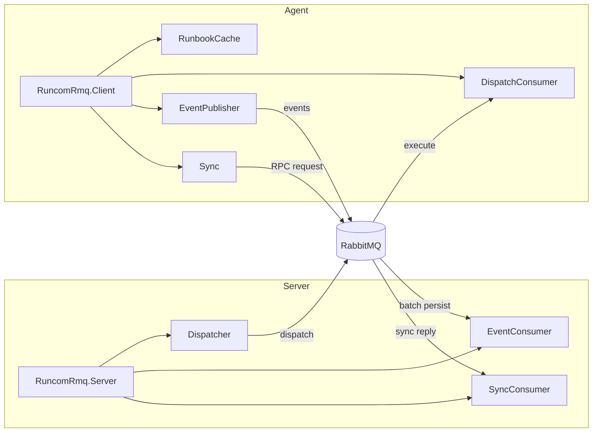

# RuncomRmq

RabbitMQ transport for Runcom. Provides Broadway-backed server and client
components for syncing runbooks, forwarding execution events, and dispatching
runs to remote agents.

## Architecture



## Installation

```elixir
def deps do
  [{:runcom_rmq, path: "../runcom_rmq"}]
end
```

## Server Setup

Add `RuncomRmq.Server` to your supervision tree. It starts three children:

- **SyncConsumer** -- Broadway pipeline handling RPC sync requests from agents
- **EventConsumer** -- Broadway pipeline persisting execution events to `Runcom.Store` and broadcasting to PubSub
- **Dispatcher** -- GenServer for dispatching runbook execution to agent nodes

```elixir
# Minimal -- reads store and pubsub from application config:
{RuncomRmq.Server, connection: "amqp://localhost"}

# Explicit:
{RuncomRmq.Server,
  connection: "amqp://localhost",
  store: {RuncomEcto.Store, repo: MyApp.Repo},
  pubsub: MyApp.PubSub,
  sync_queue: "runcom.sync.request",
  event_queue: "runcom.events"}
```

### Broadway Tuning

```elixir
{RuncomRmq.Server,
  connection: "amqp://localhost",
  sync_consumer: [
    producer_concurrency: 2,
    processor_concurrency: 4
  ],
  event_consumer: [
    producer_concurrency: 2,
    processor_concurrency: 4,
    batch_size: 100,
    batch_timeout: 2_000,
    batcher_concurrency: 4
  ],
  dispatcher: [
    ack_timeout: 10_000
  ]}
```

### Server Options

| Option | Default | Description |
|--------|---------|-------------|
| `:connection` | *required* | AMQP URI or connection keyword list |
| `:store` | `Runcom.Store.impl/0` | `{module, opts}` for persistence |
| `:pubsub` | `config :runcom_rmq, :pubsub` | Phoenix.PubSub server name |
| `:sync_queue` | `"runcom.sync.request"` | Queue for sync RPC |
| `:event_queue` | `"runcom.events"` | Queue for event ingestion |
| `:sync_consumer` | `[]` | SyncConsumer Broadway tuning |
| `:event_consumer` | `[]` | EventConsumer Broadway tuning |
| `:dispatcher` | `[]` | Dispatcher options |

## Client Setup

Add `RuncomRmq.Client` to your agent's supervision tree. It starts:

- **RunbookCache** -- ETS cache of runbook structs and hashes
- **Sync** -- GenServer performing periodic RPC sync against the server
- **EventPublisher** -- Attaches to Runcom telemetry and publishes events
- **DispatchConsumer** -- (optional) Broadway consumer for dispatch commands

```elixir
{RuncomRmq.Client,
  connection: "amqp://localhost",
  node_id: "agent-east-1",
  sync_queue: "runcom.sync.request",
  event_queue: "runcom.events",
  dispatch_queue: "runcom.dispatch.agent-east-1",
  dispatch_handler: {MyAgent.Executor, :dispatch},
  sync_interval: 30_000}
```

### Client Options

| Option | Default | Description |
|--------|---------|-------------|
| `:connection` | *required* | AMQP URI or connection keyword list |
| `:node_id` | *required* | Agent identifier string |
| `:sync_queue` | *required* | Server sync queue name |
| `:event_queue` | *required* | Server event queue name |
| `:sync_interval` | `300_000` (5 min) | Milliseconds between sync cycles |
| `:dispatch_queue` | `nil` | Node-specific queue for dispatch commands |
| `:dispatch_handler` | `nil` | `{module, function}` callback for dispatch |
| `:cache_name` | `RunbookCache` | Cache GenServer name |

## Dispatching

Send a runbook execution command to specific agent nodes:

```elixir
RuncomRmq.Server.Dispatcher.dispatch("deploy", ["agent-east-1", "agent-west-1"],
  params: %{version: "1.4.0"},
  secrets: %{api_key: "sk-..."}
)
# => [{"agent-east-1", :acked}, {"agent-west-1", :acked}]
```

## Sync Protocol

Agents periodically send their local runbook manifest (name -> hash) to the
server via RPC. The server diffs against `Runcom.Runbook.summaries/0` and replies
with bytecode bundles for new/updated runbooks and delete instructions for
removed ones.

## Event Flow

The `EventPublisher` attaches to `:telemetry` events emitted by `Runcom.Orchestrator`
and publishes them to the event queue. On the server side, `EventConsumer` batches
events, persists results/nodes via `Runcom.Store`, and broadcasts to PubSub for
real-time UI updates.
