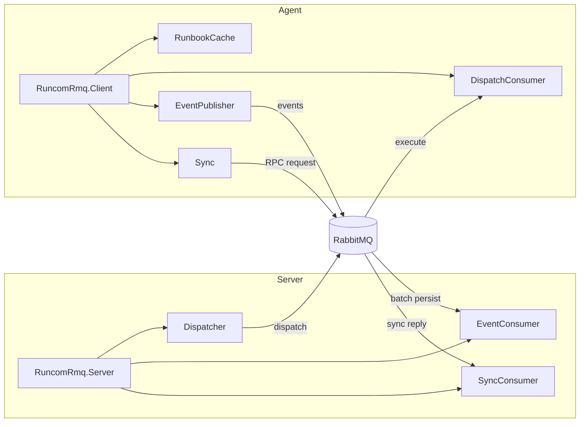
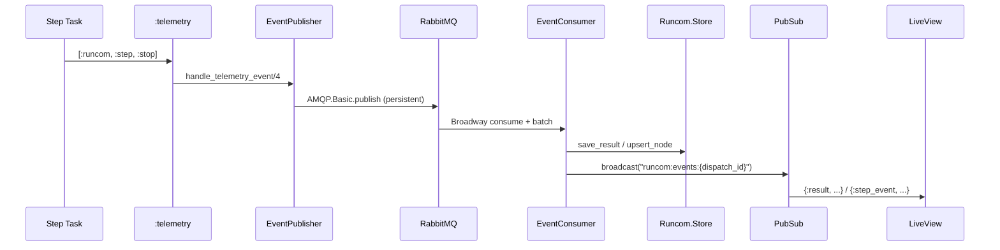

# RuncomRmq

RabbitMQ transport for Runcom. Provides Broadway-backed server and client
components for syncing runbooks, forwarding execution events, and dispatching
runs to remote agents.

## Architecture



## Installation

```elixir
def deps do
  [{:runcom_rmq, path: "../runcom_rmq"}]
end
```

## Message Signing

All messages between server and agents are serialized with `:erlang.term_to_binary/1`
and compressed with zstd via `RuncomRmq.Codec`. When a signing secret is configured,
each payload is HMAC-SHA256 signed before transmission and verified on receipt.

### Configuring the Secret

Set the same secret on **both** the server and every agent:

```elixir
# config/runtime.exs (server and agent)
config :runcom_rmq, signing_secret: System.fetch_env!("RUNCOM_SIGNING_SECRET")
```

Generate a secret:

```bash
openssl rand -base64 32
```

The secret must be identical on all nodes that exchange messages.

### How It Works

- **Encode**: payload is compressed, then `HMAC-SHA256(secret, compressed_payload)`
  is prepended as a 32-byte prefix.
- **Decode**: the first 32 bytes are split off, the HMAC is recomputed over the
  remaining bytes, and the two are compared in constant time with
  `:crypto.hash_equals/2`. If verification fails, `{:error, :invalid_signature}`
  is returned and the message is never deserialized.

### Key Rotation

To rotate the signing secret with zero downtime:

1. Deploy agents with the **new** secret
2. Once all agents are running the new secret, deploy the server with the new secret

During the transition window, agents sending with the new secret will have their
messages rejected by the server (still on the old secret). Those messages land in
the dead-letter queue and can be reprocessed after the server is updated. For
dispatches (server → agent), the same applies in reverse.

---

## Server

The server runs alongside your Phoenix app (or any OTP app with a store and
PubSub). It receives events from agents, persists results, broadcasts to
PubSub for live UI updates, and dispatches runbook execution commands to
agents.

### Setup

Add `RuncomRmq.Server` to your supervision tree:

```elixir
# Minimal -- reads store and pubsub from application config:
{RuncomRmq.Server, connection: "amqp://localhost"}

# Explicit:
{RuncomRmq.Server,
  connection: "amqp://localhost",
  store: {RuncomEcto.Store, repo: MyApp.Repo},
  pubsub: MyApp.PubSub,
  sync_queue: "runcom.sync.request",
  event_queue: "runcom.events"}
```

### Children

| Child | Type | Purpose |
|-------|------|---------|
| `SyncConsumer` | Broadway | Handles RPC sync requests from agents. Compares agent manifests against the server's runbook registry and replies with bytecode bundles for stale/missing runbooks. |
| `EventConsumer` | Broadway | Ingests execution results and step events. Persists results via `Runcom.Store`, upserts node `last_seen_at` timestamps, updates dispatch tracking, and broadcasts to PubSub. |
| `Dispatcher` | GenServer | Sends runbook execution commands to agent nodes via RPC. Publishes to each node's named queue and waits for an ack reply. |

### PubSub Topics

Events are broadcast on dispatch-scoped topics:

- **`"runcom:events:{dispatch_id}"`** -- all events for a specific dispatch.
  Payloads are tagged `{:result, map}` or `{:step_event, map}`.

Subscribe in a LiveView:

```elixir
Phoenix.PubSub.subscribe(pubsub, "runcom:events:#{dispatch_id}")

def handle_info({:result, result}, socket), do: ...
def handle_info({:step_event, event}, socket), do: ...
```

### Dispatching

Send a runbook execution command to specific agent nodes:

```elixir
RuncomRmq.Server.Dispatcher.dispatch("deploy", nodes,
  dispatch_id: dispatch_id,
  assigns: %{version: "1.4.0"}
)
# => [{"agent-east-1", :acked}, {"agent-west-1", :acked}]
```

Each node map must contain `:node_id` and `:queue` keys. Nodes are dispatched
in parallel -- each opens a short-lived AMQP channel that is closed after the
ack (or timeout), preventing queue leaks.

### Broadway Tuning

```elixir
{RuncomRmq.Server,
  connection: "amqp://localhost",
  sync_consumer: [
    producer_concurrency: 2,
    processor_concurrency: 4
  ],
  event_consumer: [
    producer_concurrency: 2,
    processor_concurrency: 4,
    batch_size: 100,
    batch_timeout: 2_000,
    batcher_concurrency: 4
  ],
  dispatcher: [
    ack_timeout: 10_000
  ]}
```

### Server Options

| Option | Default | Description |
|--------|---------|-------------|
| `:connection` | *required* | AMQP URI or connection keyword list |
| `:store` | `Runcom.Store.impl/0` | `{module, opts}` for persistence |
| `:pubsub` | `config :runcom_rmq, :pubsub` | Phoenix.PubSub server name |
| `:sync_queue` | `"runcom.sync.request"` | Queue for sync RPC |
| `:event_queue` | `"runcom.events"` | Queue for event ingestion |
| `:sync_consumer` | `[]` | SyncConsumer Broadway tuning |
| `:event_consumer` | `[]` | EventConsumer Broadway tuning |
| `:dispatcher` | `[]` | Dispatcher options (e.g. `ack_timeout`) |

---

## Client

The client runs on each remote agent node. It caches runbooks locally,
publishes execution telemetry back to the server, consumes dispatch commands,
and consumes dispatch commands.

### Setup

Add `RuncomRmq.Client` to your agent's supervision tree:

```elixir
{RuncomRmq.Client,
  connection: "amqp://localhost",
  node_id: "agent-east-1",
  sync_queue: "runcom.sync.request",
  event_queue: "runcom.events",
  dispatch_queue: "runcom.dispatch.agent-east-1",
  dispatch_handler: {MyAgent, :handle_dispatch}}
```

### Children

| Child | Type | Purpose |
|-------|------|---------|
| `RunbookCache` | GenServer + ETS | Local cache of runbook structs, hashes, and bytecodes. Enables fast lookups and manifest generation for sync. |
| `Sync` | GenServer | Fetches individual runbooks from the server via RPC when the `DispatchConsumer` encounters a cache miss. |
| `EventPublisher` | GenServer | Attaches to Runcom telemetry and publishes step/result events to the server's event queue as persistent AMQP messages. |
| `DispatchConsumer` | GenServer | *(optional)* Consumes dispatch commands from the node's named queue, resolves runbook bytecode, and calls the configured handler. Only started when `:dispatch_queue` and `:dispatch_handler` are both provided. |

### Dispatch Handler Callback

When a dispatch command arrives, the `DispatchConsumer` resolves the runbook
module and bytecodes, then calls your handler with an enriched message map:

```elixir
defmodule MyAgent do
  def handle_dispatch(message) do
    # message keys:
    #   :runbook       - resolved %Runcom{} struct, ready to execute
    #   :runbook_id    - e.g. "deploy-v1"
    #   :dispatch_id   - UUID for this dispatch batch
    #   :assigns       - variable overrides from the dispatcher

    Runcom.run_async(message.runbook,
      mode: :run,
      dispatch_id: message.dispatch_id
    )
  end
end
```

The handler is called inside the `DispatchConsumer` process. If it raises,
the exception is caught, logged with a full stacktrace, and a
`[:runcom, :run, :exception]` telemetry event is emitted.

### Telemetry Events Forwarded

The `EventPublisher` captures and forwards these telemetry events to the server:

| Event | Published As |
|-------|-------------|
| `[:runcom, :run, :stop]` | `:result` -- full execution result with step outputs |
| `[:runcom, :step, :start]` | `:step_event` -- step started |
| `[:runcom, :step, :stop]` | `:step_event` -- step completed |
| `[:runcom, :step, :exception]` | `:step_event` -- step failed |

Step outputs are truncated to `:output_truncate_bytes` (default 64KB) before
publishing.

### Client Options

| Option | Default | Description |
|--------|---------|-------------|
| `:connection` | *required* | AMQP URI or connection keyword list |
| `:node_id` | *required* | Agent identifier string |
| `:sync_queue` | *required* | Server sync queue name |
| `:event_queue` | *required* | Server event queue name |
| `:dispatch_queue` | `nil` | Node-specific queue for dispatch commands |
| `:dispatch_handler` | `nil` | `{module, function}` callback for dispatch |
| `:output_truncate_bytes` | `65_536` | Max bytes of step output per event message |
| `:cache_name` | `RunbookCache` | Cache GenServer name |
| `:name` | `RuncomRmq.Client` | Supervisor registration name |

---

## Sync Protocol

Agents fetch runbooks on-demand when a dispatch command references a runbook
that is missing or stale in the local cache. The `Sync` GenServer opens a
fresh AMQP channel, publishes an RPC request to the server's sync queue, and
waits for a reply containing bytecode bundles.

The `SyncConsumer` on the server side handles two request types:

- **`%{fetch: runbook_id}`** -- returns a single runbook's bytecode bundle
- **`%{manifest: %{id => hash, ...}}`** -- diffs against the server registry
  and returns updates/deletes

## Event Flow


