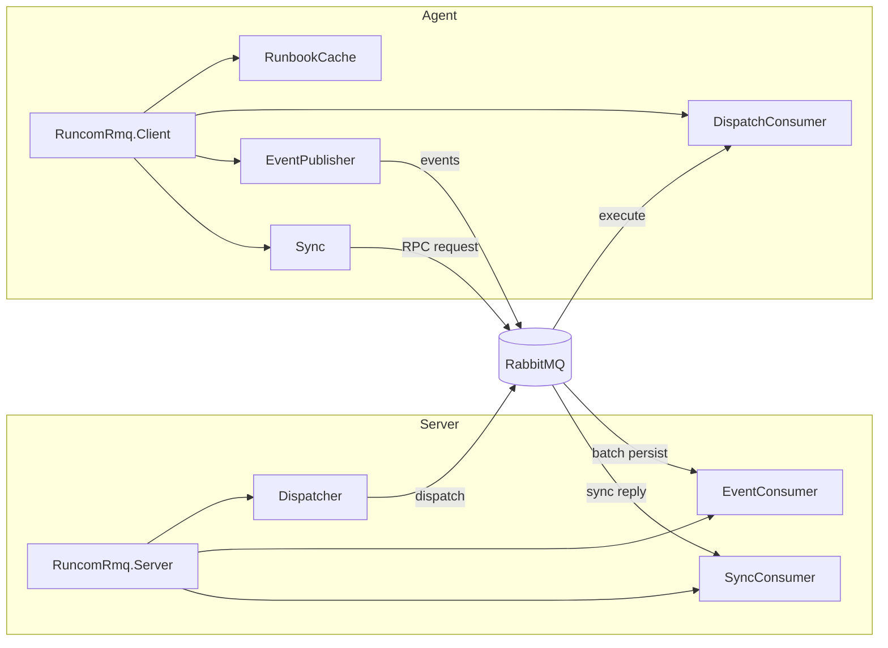
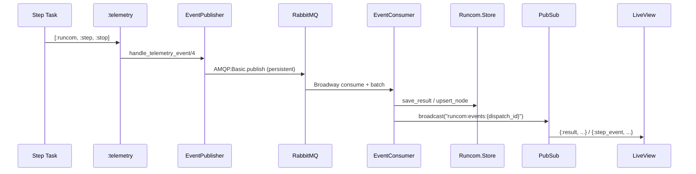

# RuncomRmq

RabbitMQ transport for Runcom. Provides Broadway-backed server and client
components for syncing runbooks, forwarding execution events, and dispatching
runs to remote agents.

**Do I need this?** If you only run runbooks locally (or on a single machine),
you don't need this package — `Runcom.run_sync/2` and `Runcom.run_async/2` work
standalone. Add RuncomRmq when you want to execute runbooks on remote agent
machines from a central server, with automatic runbook syncing and live event
streaming back to the server.

## Architecture


```mermaid
graph LR
    subgraph Server
        SS[RuncomRmq.Server]
        SC[SyncConsumer]
        EC[EventConsumer]
        D[Dispatcher]
        SS --> SC
        SS --> EC
        SS --> D
    end

    subgraph Agent
        CC[RuncomRmq.Client]
        Sync[Sync]
        EP[EventPublisher]
        DC[DispatchConsumer]
        Cache[RunbookCache]
        CC --> Sync
        CC --> EP
        CC --> DC
        CC --> Cache
    end

    RMQ[(RabbitMQ)]

    Sync -->|RPC request| RMQ -->|sync reply| SC
    EP -->|events| RMQ -->|batch persist| EC
    D -->|dispatch| RMQ -->|execute| DC
```

## Installation

```elixir
def deps do
  [{:runcom_rmq, "~> 0.1.0"}]
end
```

## Message Signing

All messages are serialized with `:erlang.term_to_binary/1`, wrapped in an
envelope carrying a timestamp and random nonce, and compressed with zstd via
`RuncomRmq.Codec`. The signature is computed over the compressed bytes and
verified **before** decompression, so unsigned payloads never reach
`binary_to_term`.

Signing is **directional**, because only one direction carries code that agents
execute:

- **Server → agent** (dispatch commands and sync responses — the messages that
  cause an agent to load bytecode and run it): signed with **Ed25519**. The
  server holds the private key; agents hold only the public key and can *verify*
  but not *forge*. A compromised agent therefore cannot impersonate the server.
- **Agent → server** (events, sync requests, ack replies — data only): signed
  with **HMAC-SHA256** using a shared secret.

### Configuring Keys

Generate an Ed25519 keypair:

```elixir
{pub, priv} = :crypto.generate_key(:eddsa, :ed25519)
{Base.encode64(pub), Base.encode64(priv)}
```

Generate the HMAC secret:

```bash
openssl rand -base64 32
```

**Server** config:

```elixir
# config/runtime.exs (server)
config :runcom_rmq,
  signing_secret: Base.decode64!(System.fetch_env!("RUNCOM_SIGNING_SECRET")),
  # signs dispatches and sync responses — NEVER ship this to agents
  signing_private_key: Base.decode64!(System.fetch_env!("RUNCOM_SIGNING_PRIVATE_KEY"))
```

**Agent** config:

```elixir
# config/runtime.exs (agent)
config :runcom_rmq,
  signing_secret: Base.decode64!(System.fetch_env!("RUNCOM_SIGNING_SECRET")),
  # verifies server-signed messages; may be a single key or a list (see rotation)
  signing_public_key: Base.decode64!(System.fetch_env!("RUNCOM_SIGNING_PUBLIC_KEY"))
```

The `signing_secret` must be identical on all nodes. The Ed25519 keys are a
single keypair: the private half stays on the server, the public half goes to
every agent.

### Replay Protection

Every message embeds a timestamp and a 16-byte nonce inside the signed envelope.
On receipt, messages older than `:max_message_age_ms` (default `300_000`) are
rejected as `{:error, :expired}`, and a nonce seen before within that window is
rejected as `{:error, :replayed}`. Nonce tracking is handled by
`RuncomRmq.ReplayGuard`, a GenServer started automatically in both the client
and server supervision trees.

```elixir
# optional, both server and agent
config :runcom_rmq, max_message_age_ms: 300_000
```

### Transport Security

Signing provides integrity and origin authentication, **not confidentiality** —
dispatch messages carry secret values and travel through (and are persisted by)
the broker in recoverable form. Use TLS (`amqps://`) for every connection so the
broker link is encrypted in transit. All examples below use `amqps://`.

### Key Rotation

**HMAC secret** — deploy the server with the new secret first, then agents.
During the window, mismatched messages are rejected and land in the dead-letter
queue (`{queue}.dead` via the `runcom.dlx` exchange) for reprocessing once all
nodes are updated.

**Ed25519 keypair** — `signing_public_key` accepts a **list** of keys;
verification succeeds if any one matches. To rotate: (1) add the new public key
to every agent's list alongside the old one, (2) switch the server to the new
private key, (3) drop the old public key from agents. This avoids a rejection
window entirely.

Monitor the dead-letter queues during rotation to ensure no messages are lost.

---

## Server

The server runs alongside your Phoenix app (or any OTP app with a store and
PubSub). It receives events from agents, persists results, broadcasts to
PubSub for live UI updates, and dispatches runbook execution commands to
agents.

### Setup

Add `RuncomRmq.Server` to your supervision tree:

```elixir
# Minimal -- reads store and pubsub from application config:
{RuncomRmq.Server, connection: "amqps://localhost"}

# Explicit:
{RuncomRmq.Server,
  connection: "amqps://localhost",
  store: {RuncomEcto.Store, repo: MyApp.Repo},
  pubsub: MyApp.PubSub,
  sync_queue: "runcom.sync.request",
  event_queue: "runcom.events"}
```

### Children

| Child | Type | Purpose |
|-------|------|---------|
| `SyncConsumer` | Broadway | Handles RPC sync requests from agents. Compares agent manifests against the server's runbook registry and replies with bytecode bundles for stale/missing runbooks. |
| `EventConsumer` | Broadway | Ingests execution results and step events. Persists results via `Runcom.Store`, upserts node `last_seen_at` timestamps, updates dispatch tracking, and broadcasts to PubSub. |
| `Dispatcher` | GenServer | Sends runbook execution commands to agent nodes via RPC. Publishes to each node's named queue and waits for an ack reply. |

### PubSub Topics

Events are broadcast on dispatch-scoped topics:

- **`"runcom:events:{dispatch_id}"`** -- all events for a specific dispatch.
  Payloads are tagged `{:result, map}` or `{:step_event, map}`.

Subscribe in a LiveView:

```elixir
Phoenix.PubSub.subscribe(pubsub, "runcom:events:#{dispatch_id}")

def handle_info({:result, result}, socket), do: ...
def handle_info({:step_event, event}, socket), do: ...
```

### Dispatching

Send a runbook execution command to specific agent nodes:

```elixir
RuncomRmq.Server.Dispatcher.dispatch("deploy", nodes,
  dispatch_id: dispatch_id,
  assigns: %{version: "1.4.0"}
)
# => [{"agent-east-1", :acked}, {"agent-west-1", :acked}]
```

Each node map must contain `:node_id` and `:queue` keys. Nodes are dispatched
in parallel -- each opens a short-lived AMQP channel that is closed after the
ack (or timeout), preventing queue leaks.

### Broadway Tuning

```elixir
{RuncomRmq.Server,
  connection: "amqps://localhost",
  sync_consumer: [
    producer_concurrency: 2,
    processor_concurrency: 4
  ],
  event_consumer: [
    producer_concurrency: 2,
    processor_concurrency: 4,
    batch_size: 100,
    batch_timeout: 2_000,
    batcher_concurrency: 4
  ],
  dispatcher: [
    ack_timeout: 10_000
  ]}
```

### Server Options

| Option | Default | Description |
|--------|---------|-------------|
| `:connection` | *required* | AMQP URI or connection keyword list |
| `:store` | `Runcom.Store.impl/0` | `{module, opts}` for persistence |
| `:pubsub` | `config :runcom_rmq, :pubsub` | Phoenix.PubSub server name |
| `:sync_queue` | `"runcom.sync.request"` | Queue for sync RPC |
| `:event_queue` | `"runcom.events"` | Queue for event ingestion |
| `:sync_consumer` | `[]` | SyncConsumer Broadway tuning |
| `:event_consumer` | `[]` | EventConsumer Broadway tuning |
| `:dispatcher` | `[]` | Dispatcher options (e.g. `ack_timeout`) |

---

## Client

The client runs on each remote agent node. It caches runbooks locally,
publishes execution telemetry back to the server, and consumes dispatch
commands.

### Setup

Add `RuncomRmq.Client` to your agent's supervision tree:

```elixir
{RuncomRmq.Client,
  connection: "amqps://localhost",
  node_id: "agent-east-1",
  sync_queue: "runcom.sync.request",
  event_queue: "runcom.events",
  dispatch_queue: "runcom.dispatch.agent-east-1",
  dispatch_handler: {MyAgent, :handle_dispatch}}
```

### Children

| Child | Type | Purpose |
|-------|------|---------|
| `RunbookCache` | GenServer + ETS | Local cache of runbook structs, hashes, and bytecodes. Enables fast lookups and manifest generation for sync. |
| `Sync` | GenServer | Fetches individual runbooks from the server via RPC when the `DispatchConsumer` encounters a cache miss. |
| `EventPublisher` | GenServer | Attaches to Runcom telemetry and publishes step/result events to the server's event queue as persistent AMQP messages. |
| `DispatchConsumer` | GenServer | *(optional)* Consumes dispatch commands from the node's named queue, resolves runbook bytecode, and calls the configured handler. Only started when `:dispatch_queue` and `:dispatch_handler` are both provided. |

### Dispatch Handler Callback

When a dispatch command arrives, the `DispatchConsumer` resolves the runbook
module and bytecodes, then calls your handler with an enriched message map:

```elixir
defmodule MyAgent do
  def handle_dispatch(message) do
    # message keys:
    #   :runbook       - resolved %Runcom{} struct, ready to execute
    #   :runbook_id    - e.g. "deploy-v1"
    #   :dispatch_id   - UUID for this dispatch batch
    #   :assigns       - variable overrides from the dispatcher

    Runcom.run_async(message.runbook,
      mode: :run,
      dispatch_id: message.dispatch_id
    )
  end
end
```

The handler is called inside the `DispatchConsumer` process. If it raises,
the exception is caught, logged with a full stacktrace, and a
`[:runcom, :run, :exception]` telemetry event is emitted.

### Telemetry Events Forwarded

The `EventPublisher` captures and forwards these telemetry events to the server:

| Event | Published As |
|-------|-------------|
| `[:runcom, :run, :stop]` | `:result` -- full execution result with step outputs |
| `[:runcom, :step, :start]` | `:step_event` -- step started |
| `[:runcom, :step, :stop]` | `:step_event` -- step completed |
| `[:runcom, :step, :exception]` | `:step_event` -- step failed |

Step outputs are truncated to `:output_truncate_bytes` (default 64KB) before
publishing.

### Client Options

| Option | Default | Description |
|--------|---------|-------------|
| `:connection` | *required* | AMQP URI or connection keyword list |
| `:node_id` | *required* | Agent identifier string |
| `:sync_queue` | *required* | Server sync queue name |
| `:event_queue` | *required* | Server event queue name |
| `:dispatch_queue` | `nil` | Node-specific queue for dispatch commands |
| `:dispatch_handler` | `nil` | `{module, function}` callback for dispatch |
| `:output_truncate_bytes` | `65_536` | Max bytes of step output per event message |
| `:cache_name` | `RunbookCache` | Cache GenServer name |
| `:name` | `RuncomRmq.Client` | Supervisor registration name |

---

## Sync Protocol

Agents fetch runbooks on-demand when a dispatch command references a runbook
that is missing or stale in the local cache. The `Sync` GenServer opens a
fresh AMQP channel, publishes an RPC request to the server's sync queue, and
waits for a reply containing bytecode bundles.

The `SyncConsumer` on the server side handles two request types:

- **`%{fetch: runbook_id}`** -- returns a single runbook's bytecode bundle
- **`%{manifest: %{id => hash, ...}}`** -- diffs against the server registry
  and returns updates/deletes

## Event Flow


```mermaid
sequenceDiagram
    participant Step as Step Task
    participant Tel as :telemetry
    participant EP as EventPublisher
    participant RMQ as RabbitMQ
    participant EC as EventConsumer
    participant Store as Runcom.Store
    participant PS as PubSub
    participant LV as LiveView

    Step->>Tel: [:runcom, :step, :stop]
    Tel->>EP: handle_telemetry_event/4
    EP->>RMQ: AMQP.Basic.publish (persistent)
    RMQ->>EC: Broadway consume + batch
    EC->>Store: save_result / upsert_node
    EC->>PS: broadcast("runcom:events:{dispatch_id}")
    PS->>LV: {:result, ...} / {:step_event, ...}
```
