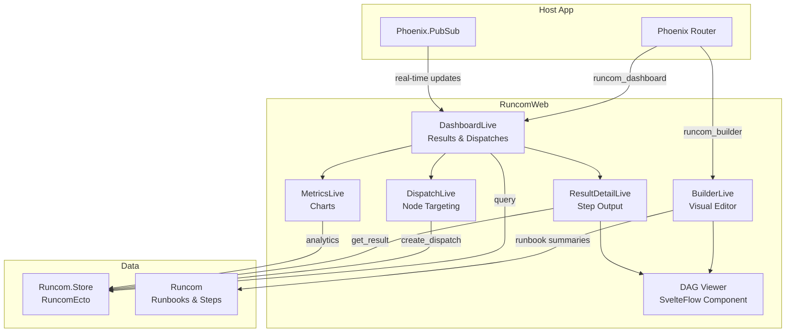

# RuncomWeb

Phoenix LiveView UI for the Runcom ecosystem. Provides a visual runbook builder,
execution dashboard, dispatch interface, and metrics views -- all mountable into
an existing Phoenix application.

## Architecture



## Installation

```elixir
def deps do
  [{:runcom_web, path: "../runcom_web"}]
end
```

## Setup

1. Configure PubSub for real-time updates:

```elixir
config :runcom_web, pubsub: MyApp.PubSub
```

2. Mount the routes in your router:

```elixir
import RuncomWeb.Router

scope "/" do
  pipe_through :browser

  runcom_builder "/builder"
  runcom_dashboard "/dashboard"
end
```

3. Build the frontend assets:

```bash
mix assets.setup   # npm install
mix assets.build   # build JS/CSS bundles
```

## Views

### Builder (`/builder`)

Three-panel visual runbook editor:

- **Step palette** -- drag built-in or custom steps onto the canvas
- **DAG canvas** -- SvelteFlow-powered graph editor with auto-layout
- **Properties panel** -- configure step options, dependencies, and secrets

Generates Elixir DSL source code from the visual graph in real-time.

Routes:
- `GET /builder` -- new runbook
- `GET /builder/:id` -- edit existing runbook

### Dashboard (`/dashboard`)

Execution results table with:

- Real-time PubSub updates as runs complete
- Full-text search across results
- Status and runbook name filters
- Node sidebar showing registered agents
- Pagination

Routes:
- `GET /dashboard` -- results list

### Result Detail (`/dashboard/result/:id`)

Single execution result with:

- Interactive DAG viewer showing step status
- Step-by-step output with stdout/stderr
- Timing and retry information

### Dispatch (`/dashboard/dispatch`)

Dispatch runbooks to agent nodes:

- Runbook selection with DAG preview
- Node picker with multi-select
- Variable overrides per dispatch
- Secret injection

### Metrics (`/dashboard/metrics`)

Charts for:

- Run rate over time
- Timing stats (avg, p50, p95, max)
- Status rates (completed vs failed)

## Components

The DAG viewer component can be used standalone in your own LiveViews:

```elixir
<RuncomWeb.dag_viewer
  id="my-dag"
  nodes={@nodes}
  edges={@edges}
  readonly={true}
  direction="TB"
  minimap={true}
/>
```

Events emitted to the parent LiveView: `"node_selected"`, `"edge_selected"`,
`"graph_changed"`, `"drop_step"`.

## Dependencies

- `phoenix_live_view` -- LiveView framework
- `live_svelte` -- Svelte component integration (SvelteFlow DAG)
- `mdex` -- Markdown rendering
- `easel` -- UI component primitives
